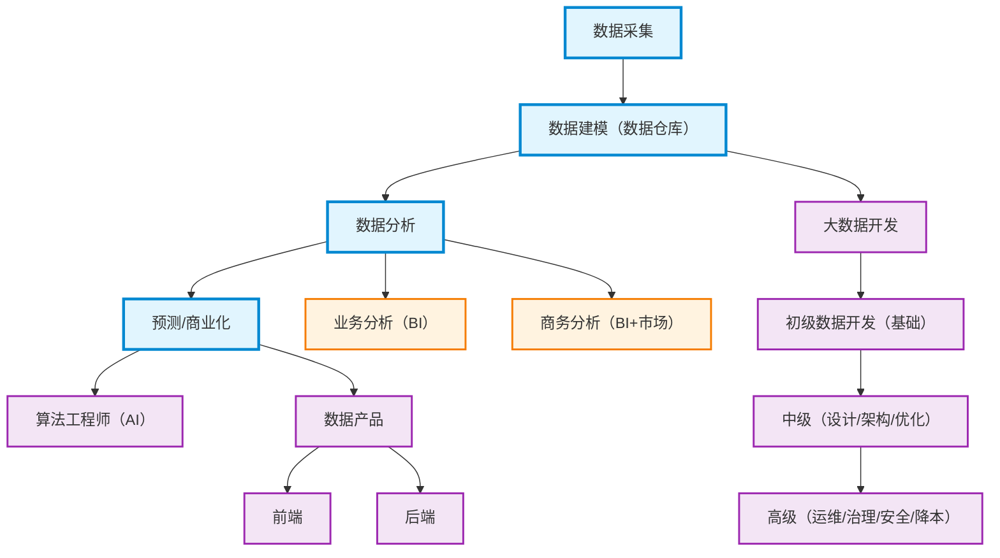

# 大数据方向职业分工与成长路径
更新于：2025-10-13

简单说明：该图展示从数据采集到分析与商业化的主干路径，以及大数据开发、业务/商务分析、算法与数据产品等角色的关系与成长阶梯。

```mermaid
graph TB
    A[数据采集]-->B[数据建模（数据仓库）]
    B-->C[数据分析]
    C-->D[预测/商业化]
    
    B-->E[大数据开发]
    E-->F[初级数据开发（基础）]
    F-->G[中级（设计/架构/优化）]
    G-->H[高级（运维/治理/安全/降本）]
    
    C-->I[业务分析（BI）]
    C-->J[商务分析（BI+市场）]
    
    D-->K[算法工程师（AI）]
    D-->L[数据产品]
    L-->M[前端]
    L-->N[后端]
    
     
    %% 样式定义
    classDef main fill:#e1f5fe,stroke:#0288d1,stroke-width:3px;
    classDef branch fill:#f3e5f5,stroke:#9c27b0,stroke-width:2px;
    classDef side fill:#fff3e0,stroke:#f57c00,stroke-width:2px;
    
    class A,B,C,D main;
    class E,F,G,H,K,L,M,N branch;
    class I,J side;
```